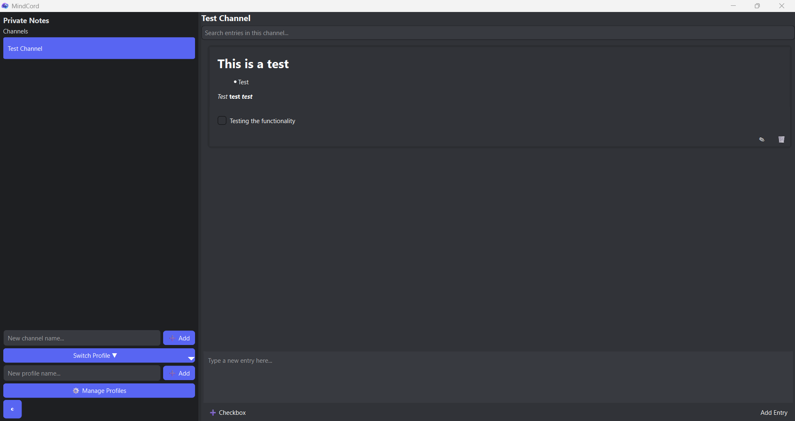
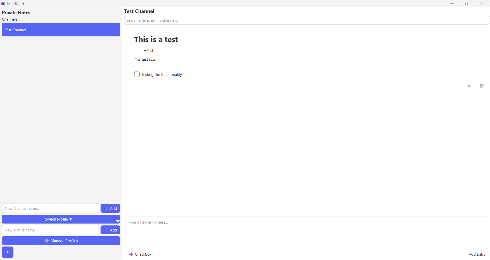

# MindCord

**MindCord** is a lightweight, Discord-style note-taking and task management application built with **Python** and **PySide6**, using **SQLite** as the database. It lets you organize notes into profiles and channels, supports checklists, and has light/dark themes.

---

## Features

* Create multiple profiles and channels.
* Add, edit, and delete notes with Markdown and task lists.
* Light and Dark themes with Discord-style UI.
* Automatic database storage in your system’s AppData folder (`%APPDATA%\MindCord\mindcord.db` on Windows).
* Cross-platform Python application (Windows tested).

---

## Screenshots

### Dark Theme


### Light Theme

---

## Installation

### From Releases (Windows)

1. Download the latest [MindCord release `.7z`](https://github.com/AmadeusSpeaks/MindCord/blob/main/releases/MindCord.7z).
2. Extract the archive to a folder of your choice.
3. Navigate into the extracted folder and install dependencies:

```bash
pip install -r requirements.txt
````

4. Run the app:

```bash
python app.py
```

> Note: This method requires Python 3.14+ and `pip` installed on your system.

### From Installer (Windows)

1. Download the [MindCord Installer](MindCord_Installer.exe).
2. Run the installer and follow the prompts.
3. The app will install in `C:\Program Files\MindCord` (default) and create the database in your AppData folder.
4. Use the Start Menu or desktop shortcut to launch MindCord.

---

## Database Location

MindCord automatically stores your notes in:

```
%APPDATA%\MindCord\mindcord.db
```

No setup is required; your notes are saved automatically.

---

## Contributing

Contributions are welcome! Please submit pull requests or open issues for bugs and feature requests.

---

## License

MindCord is licensed under the [MIT License](LICENSE).

© 2026 Amadeus H.
